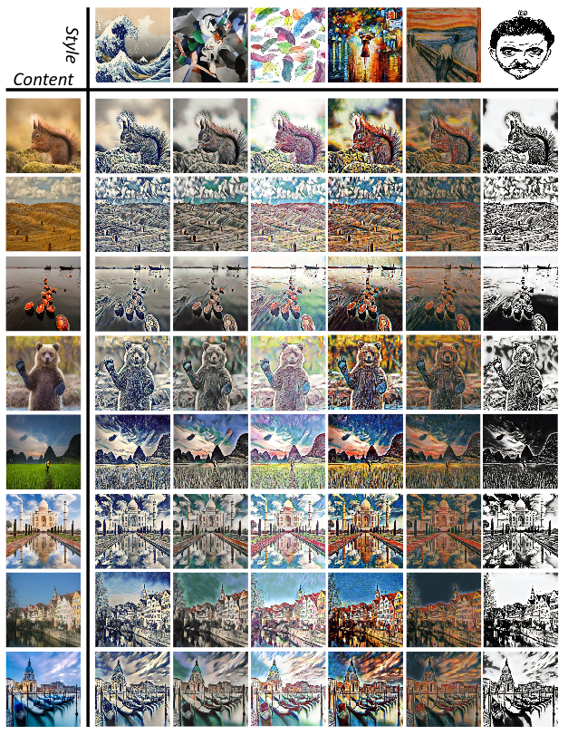

# AdaAttN: Revisit Attention Mechanism in Arbitrary Neural Style Transfer

> [[Paper](https://arxiv.org/abs/2108.03647)] [PaddlePaddle Implementation](https://github.com/wzmsltw/AdaAttN)

## Overview

Homepage of paper:

*AdaAttN: Revisit Attention Mechanism in Arbitrary Neural Style Transfer*, 

Songhua Liu, Tianwei Lin, Dongliang He, Fu Li, Meiling Wang, Xin Li, Zhengxing Sun, Qian Li, Errui Ding

ICCV 2021



## Citation

* If you find ideas useful for your research, please consider citing:

  ```
  @inproceedings{liu2021adaattn,
    title={AdaAttN: Revisit Attention Mechanism in Arbitrary Neural Style Transfer},
    author={Liu, Songhua and Lin, Tianwei and He, Dongliang and Li, Fu and Wang, Meiling and Li, Xin and Sun, Zhengxing and Li, Qian and Ding, Errui},
    booktitle={Proceedings of the IEEE International Conference on Computer Vision},
    year={2021}
  }
  ```
